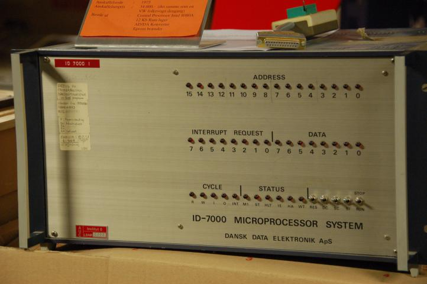

ID-7000 Emulator
================

Documentation for emulating the
`DDE ID-7000 <https://datamuseum.dk/wiki/DDE_ID-7000>`_
from ROMs.

  DDE ID7000

    .. toctree::
        :caption: ID-7000
        :maxdepth: 3
        :hidden:
